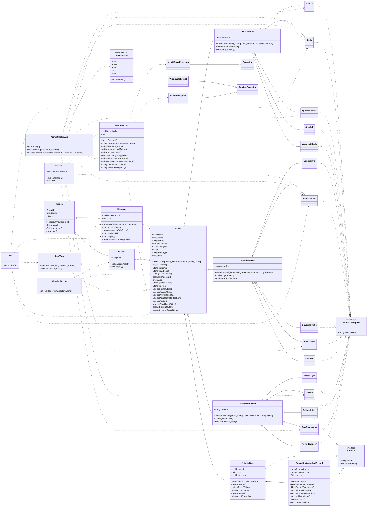

# Animal Shelter Management System - Class Diagram


```mermaid
classDiagram
    direction LR

    class Animal {
        -int animalId
        -String name
        -String adress
        -Date arrivalDate
        -boolean adopted
        -int age
        -String bloodType
        -String type
        +Animal(String, String, Date, boolean, int, String, String)
        +int getAnimalId()
        +String getName()
        +String getAdress()
        +Date getArrivalDate()
        +boolean isAdopted()
        +int getAge()
        +String getBloodType()
        +String getType()
        +void setName(String)
        +void setAdress(String)
        +void setArrivalDate(Date)
        +void setAdoptedState(Boolean)
        +void setAge(int)
        +void setBloodType(String)
        +abstract String toStore()
        +abstract void toRead(String)
    }

    class Animal.Stats {
        -double speed
        -String skin
        -double strength
        +Stats(double, String, double)
        +String toStore()
        +void toRead(String)
        +double getSpeed()
        +String getSkin()
        +double getStrength()
    }

    class Animal.Stats.MedicalRecord {
        -HashSet<String> vaccinations
        -HashSet<String> treatments
        -String notes
        +String getNotes()
        +HashSet<String> getVaccinations()
        +HashSet<String> getTreatments()
        +void addVaccin(String)
        +void addTreatment(String)
        +void setNotes(String)
        +String toStore()
        +void toRead(String)
    }

    class AerialAnimal {
        -boolean canFly
        +AerialAnimal(String, String, Date, boolean, int, String, boolean)
        +void setCanFly(boolean)
        +boolean getCanFly()
    }

    class AquaticAnimal {
        -boolean scales
        +AquaticAnimal(String, String, Date, boolean, int, String, boolean)
        +boolean getScales()
        +void setScales(boolean)
    }

    class TerrestrialAnimal {
        -String subType
        +TerrestrialAnimal(String, String, Date, boolean, int, String, String)
        +String getSubType()
        +void setSubType(String)
    }

    class AnimalDescription {
        <<interface>>
        +String description()
    }

    class Storable {
        <<interface>>
        +String toStore()
        +void toRead(String)
    }

    class Chiken
    class Dodo
    class Quetzalcoatlus
    class Shoebill
    class WedgetailEagle
    class Magnapinna
    class MantisShrimp
    class SnappingTurtle
    class WhaleShark
    class YetiCrab
    class BalistaSpider
    class BengalTiger
    class Human
    class JavaRhinoceros
    class KomodoDragon

    class Person {
        -String id
        -String name
        -int age
        +Person(String, String, int)
        +String getId()
        +String getName()
        +int getAge()
    }

    class Volunteer {
        -boolean availability
        -Set<String> skills
        +Volunteer(String, String, int, boolean)
        +void addSkill(String)
        +boolean containSkill(String)
        +void displaySkill()
        +void display()
        +boolean canTakeCare(Animal)
    }

    class Adopter {
        -int eligibility
        +boolean canAdopt()
        +void display()
    }

    class CareTask {
        +static void takeCare(Volunteer, Animal)
        +static void displayCare()
    }

    class AdoptionService {
        +static void adoption(Adopter, Animal)
    }

    class dataCollection {
        -HashSet<Animal> animals
        -int id
        +int getCurrentId()
        +String getIdForAnimal(Animal, String)
        +void addAnimal(Animal)
        +void removeAnimal(Animal)
        +void displayAnimals()
        +static void verifyEntry(Animal)
        +void addToDataBase(Animal)
        +void removeFromDataBase(Animal)
        +String formatOutput(String)
        +String listDataBase(String)
    }

    class dataTester {
        -String pathToDataBase
        +dataTester(String)
        +void test()
    }

    class InvalidEntryException
    class WrongDataFormat
    class ShelterException

    class AnimalShelterApp {
        +main(String[])
        +MenuOption getRequest(Scanner)
        +boolean shouldDisplay(MenuOption, Scanner, dataCollection)
    }

    class MenuOption {
        <<enumeration>>
        VIEW
        ADOPT
        ADD
        TEST
        END
        +fromValue(int)
    }

    class Test {
        +main(String[])
    }

    Animal <|-- AerialAnimal
    Animal <|-- AquaticAnimal
    Animal <|-- TerrestrialAnimal

    AerialAnimal <|-- Chiken
    AerialAnimal <|-- Dodo
    AerialAnimal <|-- Quetzalcoatlus
    AerialAnimal <|-- Shoebill
    AerialAnimal <|-- WedgetailEagle

    AquaticAnimal <|-- Magnapinna
    AquaticAnimal <|-- MantisShrimp
    AquaticAnimal <|-- SnappingTurtle
    AquaticAnimal <|-- WhaleShark
    AquaticAnimal <|-- YetiCrab

    TerrestrialAnimal <|-- BalistaSpider
    TerrestrialAnimal <|-- BengalTiger
    TerrestrialAnimal <|-- Human
    TerrestrialAnimal <|-- JavaRhinoceros
    TerrestrialAnimal <|-- KomodoDragon

    Chiken ..|> AnimalDescription
    Dodo ..|> AnimalDescription
    Quetzalcoatlus ..|> AnimalDescription
    Shoebill ..|> AnimalDescription
    WedgetailEagle ..|> AnimalDescription
    Magnapinna ..|> AnimalDescription
    MantisShrimp ..|> AnimalDescription
    SnappingTurtle ..|> AnimalDescription
    WhaleShark ..|> AnimalDescription
    YetiCrab ..|> AnimalDescription
    BalistaSpider ..|> AnimalDescription
    BengalTiger ..|> AnimalDescription
    Human ..|> AnimalDescription
    JavaRhinoceros ..|> AnimalDescription
    KomodoDragon ..|> AnimalDescription

    BalistaSpider ..|> Storable

    Animal *-- Animal.Stats
    Animal.Stats *-- Animal.Stats.MedicalRecord
    Animal.Stats ..|> Storable
    Animal.Stats.MedicalRecord ..|> Storable

    Person <|-- Volunteer
    Person <|-- Adopter

    Volunteer ..> Animal
    Adopter ..> Animal
    AdoptionService ..> Adopter
    AdoptionService ..> Animal

    CareTask ..> Volunteer
    CareTask ..> Animal

    dataCollection ..> Animal
    dataCollection ..> InvalidEntryException
    dataCollection ..> ShelterException
    dataTester ..> dataCollection
    dataTester ..> Dodo
    dataTester ..> MantisShrimp
    dataTester ..> JavaRhinoceros

    AnimalShelterApp ..> dataCollection
    AnimalShelterApp ..> MenuOption
    AnimalShelterApp ..> Dodo
    AnimalShelterApp ..> Chiken
    AnimalShelterApp ..> Quetzalcoatlus
    AnimalShelterApp ..> MantisShrimp
    AnimalShelterApp ..> WhaleShark
    AnimalShelterApp ..> Human

    Test ..> Dodo
    Test ..> MantisShrimp
    Test ..> Volunteer
    Test ..> CareTask
    Test ..> Animal

    InvalidEntryException --|> Exception
    WrongDataFormat --|> RuntimeException
    ShelterException --|> RuntimeException
```


    InvalidEntryException --|> Exception
    WrongDataFormat --|> RuntimeException
```
